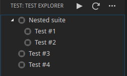

# Acutest Test Adapter for Visual Studio Code

This repository contains a `AcutestTestAdapter` extension that works with the
[Test Explorer](https://marketplace.visualstudio.com/items?itemName=hbenl.vscode-test-explorer) extension.

Acutest is a header only C/C++ unit testing framework.

More documentation can be found in the [Test Adapter API repository](https://github.com/hbenl/vscode-test-adapter-api).


<br>


## Setup

There are two settings you need to configure to make the tests work:

* ```acutestExplorer.testExecutable``` Relative path in the workspace root folder to executable that contains all tests
* ```acutestExplorer.testsourceFile``` Relative path in the workspace root folder to test source code containing TEST_LIST definition

You can access these settings in ```File```->```Preferences```->```Settings```

## Compiling/Running code

* install the [Test Explorer](https://marketplace.visualstudio.com/items?itemName=hbenl.vscode-test-explorer) extension
* fork and clone this repository and open it in VS Code
* run `npm install`
* run `npm run watch` or start the watch Task in VS Code
* start the debugger

You should now see a second VS Code window, the Extension Development Host.
Open a folder in this window and click the "Test" icon in the Activity bar.
Now you should see the fake example test suite in the side panel:


